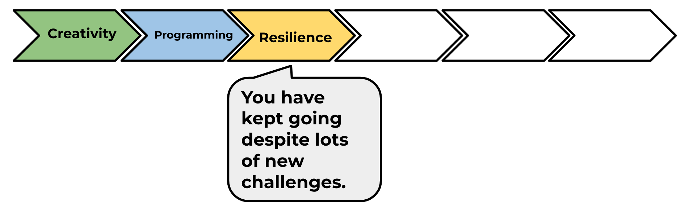

--- challenge ---
## Challenge: Dashed lines

Can you use a loop to make the track lines dashed instead of solid?

**Hint:** Find the code that draws a straight line. Try using:`for`, `forward()`, `penup()` and `pendown()`

Go to the 'Skills in Careers' activity and then on to the next project on the module pathway: 'Team Chooser'.

--- /challenge ---

